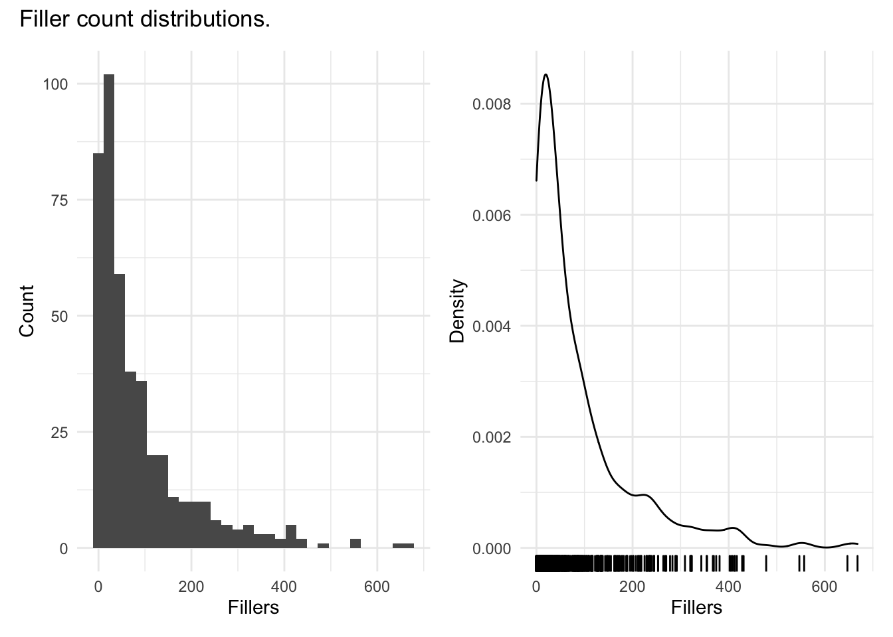
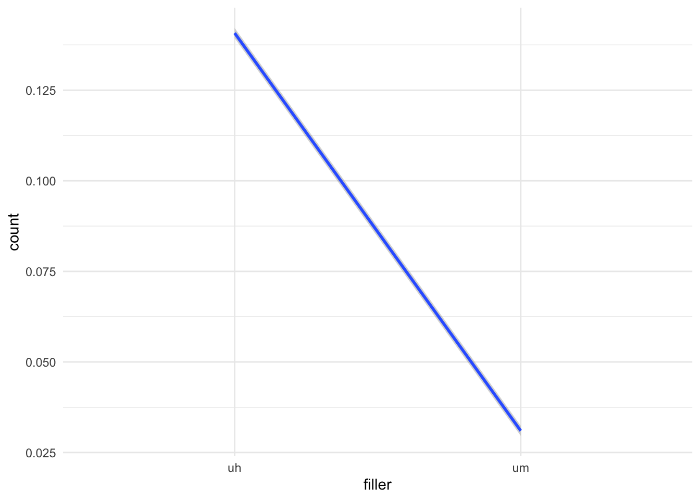

# (PART) Analysis {-}

# Overview {-#analysis-overview}


# Inference {#inference}

<p style="font-weight:bold; color:red;">INCOMPLETE DRAFT</p>

> People generally see what they look for, and hear what they listen for.
>
> -- Harper Lee, To Kill a Mockingbird


<div class="rmdkey">
<p>The essential questions for this chapter are:</p>
<ul>
<li>what are the three main types of inferential analysis approaches?</li>
<li>how does the informational value of the dependent variable relate to the statistical approach adopted?</li>
<li>how to descriptive, statistical, and evaluative steps work together to produce the reliable results?</li>
</ul>
</div>

<!-- COURSE STRUCTURE

TUTORIALS:

- ...

SWIRL:

- ...

WORKED/ RECIPE:

- ...

PROJECT:

- ...

GOALS:

...

-->


In this chapter we consider approaches to deriving knowledge from information which can be generalized to the population from which the information is sampled. This process is known as statistical inference. The discussion here builds on concepts developed in [Chapter 3 "Approaching analysis"](#approaching-analysis) and implements descriptive assessments, statistical tests, and evaluation procedures for series of contexts which are common in the analysis of corpus-based data. The chapter is structured into three main sections which correspond to the number of variables included in the statistical procedure. Each of these sections includes a subsection dedicated to the informational value of the dependent variable; the variable whose variation is to be explained.

For this discussion two datasets will be used as the base to pose various questions to submit for interrogation. It is of note that the questions in the subsequent sections are posited to highlight various descriptive, statistic, and evaluation procedures and do not reflect the standard approach to hypothesis testing which assumes that the null and alternative hypotheses are developed at the outset of the research project.

The process for each inferential data analysis in this section will include three steps: (1) descriptive assessment, (2) statistical interrogation, and (3) evaluation of the results.

<!-- TODO:
- Add Bresnan citation for questions to interrogate `dative`?
- Add Tottie citation for questions to interrogate `sdac_disfluencies`?

-->

## Preparation

At this point let's now get familiar with the datasets and prepare them for analysis. The first dataset to consider is the `dative` dataset. This dataset can be loaded from the languageR package [@R-languageR].  


```r
dative <- 
  languageR::dative %>% # load the `dative` dataset  
  as_tibble() # convert the data frame to a tibble object
  
glimpse(dative) # preview structure 
#> Rows: 3,263
#> Columns: 15
#> $ Speaker                <fct> NA, NA, NA, NA, NA, NA, NA, NA, NA, NA, NA, NA,…
#> $ Modality               <fct> written, written, written, written, written, wr…
#> $ Verb                   <fct> feed, give, give, give, offer, give, pay, bring…
#> $ SemanticClass          <fct> t, a, a, a, c, a, t, a, a, a, a, a, t, a, c, a,…
#> $ LengthOfRecipient      <int> 1, 2, 1, 1, 2, 2, 2, 1, 1, 1, 2, 2, 1, 2, 1, 1,…
#> $ AnimacyOfRec           <fct> animate, animate, animate, animate, animate, an…
#> $ DefinOfRec             <fct> definite, definite, definite, definite, definit…
#> $ PronomOfRec            <fct> pronominal, nonpronominal, nonpronominal, prono…
#> $ LengthOfTheme          <int> 14, 3, 13, 5, 3, 4, 4, 1, 11, 2, 3, 3, 5, 2, 8,…
#> $ AnimacyOfTheme         <fct> inanimate, inanimate, inanimate, inanimate, ina…
#> $ DefinOfTheme           <fct> indefinite, indefinite, definite, indefinite, d…
#> $ PronomOfTheme          <fct> nonpronominal, nonpronominal, nonpronominal, no…
#> $ RealizationOfRecipient <fct> NP, NP, NP, NP, NP, NP, NP, NP, NP, NP, NP, NP,…
#> $ AccessOfRec            <fct> given, given, given, given, given, given, given…
#> $ AccessOfTheme          <fct> new, new, new, new, new, new, new, new, accessi…
```

From `glimpse()` we can see that this dataset contains 3,263 observations and 15 columns. 

The R Documentation can be consulted using `?dative` in the R Console. The description states: 

> Data describing the realization of the dative as NP or PP in the Switchboard corpus and the Treebank Wall Street Journal collection.

For a bit more context, a dative is the phrase which reflects the entity that takes the recipient role in a ditransitive clause. In English, the recipient (dative) can be realized as either a noun phrase (NP) as seen in (1) or as a prepositional phrase (PP) as seen in (2) below. 

1. They give [you ~NP~] a drug test.
2. They give a drug test [to you ~PP~].

Together these two syntactic options are known as the Dative Alternation.

The observational unit for this dataset is `RealizationOfRecipient` variable which is either 'NP' or 'PP'. For the purposes of this chapter I will select a subset of the key variables we will use in the upcoming analyses and drop the others. 


```r
dative <- 
  dative %>% # dataset
  select(RealizationOfRecipient, Modality, LengthOfRecipient, LengthOfTheme) %>% # select key variables
  janitor::clean_names() # normalize variable names
```

Table: (\#tab:i-dative-preview)First 10 observations of simplified `dative` dataset.

|realization_of_recipient |modality | length_of_recipient| length_of_theme|
|:------------------------|:--------|-------------------:|---------------:|
|NP                       |written  |                   1|              14|
|NP                       |written  |                   2|               3|
|NP                       |written  |                   1|              13|
|NP                       |written  |                   1|               5|
|NP                       |written  |                   2|               3|
|NP                       |written  |                   2|               4|
|NP                       |written  |                   2|               4|
|NP                       |written  |                   1|               1|
|NP                       |written  |                   1|              11|
|NP                       |written  |                   1|               2|

In Table \@ref(tab:i-dative-dictionary) I've created a data dictionary describing the variables in our new `dative` dataset based on the variable descriptions in the `languageR::dative` documentation.


Table: (\#tab:i-dative-dictionary)Data dictionary for the `dative` dataset.

|variable_name            |name                     |description                                                           |
|:------------------------|:------------------------|:---------------------------------------------------------------------|
|realization_of_recipient |Realization of Recipient |A factor with levels NP and PP coding the realization of the dative.  |
|modality                 |Language Modality        |A factor with levels *spoken*, *written*.                             |
|length_of_recipient      |Length of Recipient      |A numeric vector coding the number of words comprising the recipient. |
|length_of_theme          |Length of Theme          |A numeric vector coding the number of words comprising the theme.     |

The second dataset that we will use in this chapter is the `sdac_disfluencies` dataset that we worked to derived in the previous chapter. Let's read in the dataset and preview the structure. 


```r
sdac_disfluencies <- read_csv(file = "../data/derived/sdac/sdac_disfluencies.csv")  # read transformed dataset

glimpse(sdac_disfluencies)  # preview structure
```


```
#> Rows: 447,212
#> Columns: 9
#> $ doc_id         <dbl> 4325, 4325, 4325, 4325, 4325, 4325, 4325, 4325, 4325, 4…
#> $ speaker_id     <dbl> 1632, 1632, 1632, 1632, 1519, 1519, 1632, 1632, 1519, 1…
#> $ utterance_text <chr> "Okay.  /", "Okay.  /", "{D So, }", "{D So, }", "[ [ I …
#> $ filler         <chr> "uh", "um", "uh", "um", "uh", "um", "uh", "um", "uh", "…
#> $ count          <dbl> 0, 0, 0, 0, 0, 0, 0, 0, 1, 0, 0, 0, 0, 0, 1, 0, 0, 0, 0…
#> $ sex            <chr> "FEMALE", "FEMALE", "FEMALE", "FEMALE", "FEMALE", "FEMA…
#> $ birth_year     <dbl> 1962, 1962, 1962, 1962, 1971, 1971, 1962, 1962, 1971, 1…
#> $ dialect_area   <chr> "WESTERN", "WESTERN", "WESTERN", "WESTERN", "SOUTH MIDL…
#> $ education      <dbl> 2, 2, 2, 2, 1, 1, 2, 2, 1, 1, 2, 2, 1, 1, 1, 1, 1, 1, 1…
```

We prepared a data dictionary that reflects this transformed dataset. Let's read that file and then view it Table \@ref(tab:i-sdac-disfluencies-diciontary-read-run). 


```r
sdac_disfluencies_dictionary <- read_csv(file = "../data/derived/sdac/sdac_disfluencies_data_dictionary.csv")  # read data dictionary
```


Table: (\#tab:i-sdac-disfluencies-dictionary)Data dictionary for the `sdac_disfluencies` dataset.

|variable_name  |name           |description                                                                        |
|:--------------|:--------------|:----------------------------------------------------------------------------------|
|doc_id         |Document ID    |Unique identifier for each conversation file.                                      |
|speaker_id     |Speaker ID     |Unique identifier for each speaker in the corpus.                                  |
|utterance_text |Utterance Text |Transcribed utterances for each conversation. Includes disfluency annotation tags. |
|filler         |Filler         |Filler type either uh or um.                                                       |
|count          |Count          |Number of fillers for each utterance.                                              |
|sex            |Sex            |Sex for each speaker either male or female.                                        |
|birth_year     |Birth Year     |The year each speaker was born.                                                    |
|dialect_area   |Dialect Area   |Region from the US where the speaker spent first 10 years.                         |
|education      |Education      |Highest educational level attained: values 0, 1, 2, 3, and 9.                      |

For our analysis purposes we will reduce this dataset, as we did for the `dative` dataset, retaining only the variables of interest for the upcoming analyses. 


```r
sdac_disfluencies <- 
  sdac_disfluencies %>% # dataset
  select(speaker_id, filler, count, sex, birth_year, education) # select key variables
```

Let's preview this simplified `sdac_disfluencies` dataset. 


Table: (\#tab:i-sdac-disfluencies-preview)First 10 observations of simplified `sdac_disfluencies` dataset.

| speaker_id|filler | count|sex    | birth_year| education|
|----------:|:------|-----:|:------|----------:|---------:|
|       1632|uh     |     0|FEMALE |       1962|         2|
|       1632|um     |     0|FEMALE |       1962|         2|
|       1632|uh     |     0|FEMALE |       1962|         2|
|       1632|um     |     0|FEMALE |       1962|         2|
|       1519|uh     |     0|FEMALE |       1971|         1|
|       1519|um     |     0|FEMALE |       1971|         1|
|       1632|uh     |     0|FEMALE |       1962|         2|
|       1632|um     |     0|FEMALE |       1962|         2|
|       1519|uh     |     1|FEMALE |       1971|         1|
|       1519|um     |     0|FEMALE |       1971|         1|

Now the `sdac_disfluencies` dataset needs some extra transformation to better prepare it for statistical interrogation. On the one hand the variables `birth_year` and `education` are not maximally informative. First it would be more ideal if `birth_year` would reflect the age of the speaker at the time of the conversation(s) and furthermore the coded values of `education` are not explicit as far what the numeric values refer to.

The second issue has to do with preparing the `sdac_disfluencies` dataset for statistical analysis. This involves converting our column types to the correct vector types for statistical methods. Specifically we need to convert our categorical variables to the R type 'factor' (fct). This includes of our current variables which are character vectors, but also the `speaker_id` and `education` which appear as numeric but do not reflect a continuous variables; one  is merely a code which uniquely labels each speaker and the other is an ordinal list of educational levels.

This will be a three step process, first we will normalize the `birth_year` to reflect the age of the speaker, second we will convert all the relevant categorical variables to factors, and third we will convert the `education` variable to a factor adding meaningful labels for the levels of this factor.

Consulting the [online manual for this corpus](https://catalog.ldc.upenn.edu/docs/LDC97S62/swb1_manual.txt), we see that the recording date for these conversations took place in 1992, so we can simply subtract the `birth_year` from 1992 to get each participant's age. We'll rename this new column `age` and drop the `birth_year` column. 


```r
sdac_disfluencies <- 
  sdac_disfluencies %>% # dataset
  mutate(age = (1992 - birth_year)) %>% # calculate age
  select(-birth_year) # drop `birth_year` column
```

Now let's convert all the variables which are character vectors. We can do this using the the `factor()` function; first on `speaker_id` and then, with the help of `mutate_if()`, to all the other variables which are character vectors. 


```r
sdac_disfluencies <- 
  sdac_disfluencies %>% # dataset
  mutate(speaker_id = factor(speaker_id)) %>% # convert numeric to factor
  mutate_if(is.character, factor) # convert all character to factor
```


We know from the data dictionary that the `education` column contains four values (0, 1, 2, 3, and 9). Again, consulting the corpus manual we can see what these values mean. 

```
EDUCATION    COUNT
--------------------

0            14      less than high school
1            39      less than college
2            309     college
3            176     more than college
9            4       unknown
```

So let's convert `education` to a factor adding these descriptions as factor level labels. The function `factor()` can take an argument `labels = ` which we can manually assign the label names for the factor levels in the order of the factor levels. Since the original values were numeric, the factor level ordering defaults to ascending order.


```r
sdac_disfluencies <- 
  sdac_disfluencies %>% # dataset
  mutate(education = factor(education, 
                            labels = c("less than high school", # value 0
                                       "less than college", # value 1
                                       "college", # value 2
                                       "more than college", # value 3 
                                       "unknown"))) # value 9
```

So let's take a look at the `sdac_disfluencies` dataset we've prepared for analysis.


```r
glimpse(sdac_disfluencies)
#> Rows: 447,212
#> Columns: 6
#> $ speaker_id <dbl> 1632, 1632, 1632, 1632, 1519, 1519, 1632, 1632, 1519, 1519,…
#> $ filler     <chr> "uh", "um", "uh", "um", "uh", "um", "uh", "um", "uh", "um",…
#> $ count      <dbl> 0, 0, 0, 0, 0, 0, 0, 0, 1, 0, 0, 0, 0, 0, 1, 0, 0, 0, 0, 0,…
#> $ sex        <chr> "FEMALE", "FEMALE", "FEMALE", "FEMALE", "FEMALE", "FEMALE",…
#> $ education  <chr> "college", "college", "college", "college", "less than coll…
#> $ age        <dbl> 30, 30, 30, 30, 21, 21, 30, 30, 21, 21, 30, 30, 21, 21, 21,…
```

Now the datasets `dative` and `sdac_disfluencies` are ready to be statistically interrogated.


## Univariate analysis

In what follows I will provide a description of inferential data analysis when only one variable is to be interrogated. This is known as a univariate analysis, or one-variable analysis. We will consider a case when the variable is categorical and the other continuous. 

### Categorical

As an example of a univariate analysis where the variable used in the analysis is categorical we will look at the `dative` dataset. In this analysis we may be interested in knowing whether the recipient role in a ditransitive construction is realized more as an 'NP' or 'PP'. 

**Descriptive assessment**

The `realization_of_recipient` variable contains the relevant information. Let's take a first look using the skimr package.


```r
dative %>% # dataset
  select(realization_of_recipient) %>% # select the variable
  skim() %>% # get data summary
  yank("factor") # only show factor-oriented information
```


**Variable type: factor**

|skim_variable            | n_missing| complete_rate|ordered | n_unique|top_counts        |
|:------------------------|---------:|-------------:|:-------|--------:|:-----------------|
|realization_of_recipient |         0|             1|FALSE   |        2|NP: 2414, PP: 849 |

The output from `skim()` produces various pieces of information that can be helpful. On the one hand we get diagnostics that tell us if there are missing cases (`NA` values), what the proportion of complete cases is, if the the factor is ordered, how many distinct levels the factor has, as well as the level counts. 

Looking at the `top_counts` we can see that of the 3,263 observations, in 2,414 the dative is expressed as an 'NP' and 849 as 'PP'. Numerically we can see that there is a difference between the use of the alternation types. A visualization is often helpful for descriptive purposes in statistical analysis. In this particular case, however, we are considering a single categorical variable with only two levels (values) so a visualization is not likely to be more informative than the numeric values we have already obtained. But for demonstration purposes and to get more familiar with building plots, let's create a visualization.


```r
dative %>% # dataset
  ggplot(aes(x = realization_of_recipient)) + # mapping
  geom_bar() + # geometry
  labs(x = "Realization of recipient", y = "Count") # labels
```


The question we want to address, however, is whether this numerical difference is in fact a statistical difference.

**Statistical interrogation**

<!-- TODO:
- consider binom.test() vs. chisq.test() for two outcome univariate
-->

To statistical assess the distribution for a categorical variable, we will turn to the Chi-squared test. This test aims to gauge whether the numerical differences between 'NP' and 'PP' counts observed in the data is greater than what would be expected by chance. Chance in the case where there are only two possible outcome levels is 50/50. For our particular data where there are 3,263 observations half would be 'NP' and the other half 'PP' --specifically 1631.5 for each. 

To run this test we first will need to create a cross-tabulation of the variable. We will use the `xtabs()` function to create the table.


```r
ror_table <- 
  xtabs(formula = ~ realization_of_recipient, # formula selecting the variable
        data = dative) # dataset

ror_table # preview
#> realization_of_recipient
#>   NP   PP 
#> 2414  849
```

No new information here, but the format (i.e. an object of class 'table') is what is important for the input argument for the `chisq.test()` function we will use to run the test. 


```r
c1 <- chisq.test(x = ror_table)  # apply the chi-squared test to `ror_table`

c1  # preview the test results
#> 
#> 	Chi-squared test for given probabilities
#> 
#> data:  ror_table
#> X-squared = 751, df = 1, p-value <2e-16
```

The preview of the `c1` object reveals the main information of interest including the Chi-squared statistic, the degrees of freedom, and the $p$-value (albeit in scientific notation). However, the `c1` is an 'htest' object an includes a number of other pieces information about the test.


```r
names(c1)  # preview column names
#> [1] "statistic" "parameter" "p.value"   "method"    "data.name" "observed" 
#> [7] "expected"  "residuals" "stdres"
```

For our purposes let's simply confirm that the $p$-value is lower than the standard .05 threshold for statistical significance.


```r
c1$p.value < 0.05  # confirm p-value below .05
#> [1] TRUE
```

Other information can be organized in a more readable format using the broom package's `augment()` function. 


```r
c1 %>% # statistical result
  augment() # view detailed statistical test information
#> # A tibble: 2 × 6
#>   realization_of_recipient .observed .prop .expected .resid .std.resid
#>   <fct>                        <int> <dbl>     <dbl>  <dbl>      <dbl>
#> 1 NP                            2414 0.740     1632.   19.4       27.4
#> 2 PP                             849 0.260     1632.  -19.4      -27.4
```
Here we can see the observed and expected counts and the proportions for each level of `realization_of_recipient`. We also get additional information concerning residuals, but we will leave these aside. 

**Evaluation**

At this point we may think we are done. We have statistically interrogated the `realization_of_recipient` variable and found that the difference between 'NP' and 'PP' realization in the datives in this dataset is statistically significant. However, we need to evaluate the size ('effect size') and the reliability of the effect ('confidence interval'). The effectsize package provides a function `effectsize()` that can provide us both the effect size and confidence interval.


```r
effects <- effectsize(c1)  # evaluate effect size and generate a confidence interval

effects  # preview effect size and confidence interval
#> Cramer's V |       95% CI
#> -------------------------
#> 0.48       | [0.39, 0.52]
```

`effectsize()` recognizes the type of test results in `c1` and calculates the appropriate effect size measure and generates a confidence interval. Since the effect statistic ("Cramer's V") falls between the 95\% confidence interval this suggests the results are reliably interpreted (chances of Type I (false positive) or Type II (false negative) are low). 

Now, the remaining question is to evaluate whether the significant result here is a strong effect or not. To do this we can pass the effect size measure to the `interpret_r()` function. 


```r
interpret_r(effects$Cramers_v)
#> [1] "very large"
#> (Rules: funder2019)
```

Turns out we have a strong effect; the realization of dative alternation heavily favors the 'NP' form in our data. The potential reasons why are not considered in this univariate analysis, but we will return to this question later as we add independent variables to the statistical analysis. 

### Continuous

Now let's turn to a case when the variable we aim to interrogate is non-categorical. For this case we will turn to the `sdac_disfluencies` dataset. Specifically we will aim to test whether the use of fillers is normally distributed across speakers.

<div class="rmdtip">
<p>This is an important step when working with numeric dependent variables as the type of distribution will dictate decisions about whether we will use parametric or non-parametric tests if we consider the extent to which an independent variable (or variables) can explain the variation of the dependent variable.</p>
</div>

Since the dataset is currently organized around fillers as the observational unit, I will first transform this dataset to sum the use of fillers for each speaker in the dataset. 


```r
sdac_fillers <- 
  sdac_disfluencies %>% # dataset
  group_by(speaker_id) %>% # group by each speaker
  summarise(sum = sum(count)) %>% # add up all fillers used
  ungroup() # remove grouping parameter
```


Table: (\#tab:i-uni-cont-sdac-transform-preview)First 10 observations of `sdac_fillers` dataset.

|speaker_id | sum|
|:----------|---:|
|155        |  28|
|1000       |  45|
|1001       | 264|
|1002       |  54|
|1004       |  45|
|1005       | 129|
|1007       |   0|
|1008       |  27|
|1010       |   2|
|1011       |  54|

**Descriptive assessment**

Let's perform some descriptive assessement of the variable of interest `sum`. First let's apply the `skim()` function and retrieve just the relevant numeric descriptors with `yank()`. One twist here, however, is that I've customized the `skim()` function using the `skim_with()` to remove the default histogram and add the Interquartile Range (IQR) to the output. This new skim function `num_skim()` will take the place of `skim()`.


```r
num_skim <- 
  skim_with(numeric = sfl(hist = NULL, # remove hist skim
                                   iqr = IQR)) # add IQR to skim

sdac_fillers %>% # dataset
  select(sum) %>% # variable of interest
  num_skim() %>% # get custom data summary
  yank("numeric") # only show numeric-oriented information
```


**Variable type: numeric**

|skim_variable | n_missing| complete_rate| mean|  sd| p0| p25| p50| p75| p100| iqr|
|:-------------|---------:|-------------:|----:|---:|--:|---:|---:|---:|----:|---:|
|sum           |         0|             1| 87.1| 108|  0|  16|  45| 114|  668|  98|

We see here that the mean use of fillers is 87.1 across speakers. However, the standard deviation and IQR are large relative to this mean which indicates that the dispersion is quite large, in other words this suggests that there are large differences between speakers. Furthermore, since the median (p50) is smaller than the mean, the distribution is right skewed.

Let's look a couple visualizations of this distribution to appreciate these descriptives. A histogram will provide us a view of the distribution using the counts of the values of `sum` and a density plot will provide a smooth curve which represents the scaled distribution of the observed data.

<!-- TODO:
- consider generating a normal distribution to overlay on the density plot
https://homepage.divms.uiowa.edu/~luke/classes/STAT4580/histdens.html
- consider log-transformed distribution?
  - # View `sum` as order of magnitudes
-->


```r
p1 <- 
  sdac_fillers %>% # dataset
  ggplot(aes(sum)) + # mapping
  geom_histogram() +  # geometry
  labs(x = "Fillers", y = "Count")

p2 <- 
  sdac_fillers %>% # dataset
  ggplot(aes(sum)) + # mapping
  geom_density() + # geometry
  geom_rug() +  # visualize individual observations
  labs(x = "Fillers", y = "Density")

p1 + p2 + plot_annotation("Filler count distributions.")
```


From these plots that our initial intuitions about the distribution of `sum` are correct. There is large dispersion between speakers and the data distribution is right skewed. 

<div class="rmdtip">
<p>Note that I’ve used the patchwork package for organizing the display of plots and including a plot annotation label.</p>
</div>

Since our aim is to test for normality, we can generate a Quantile-Quantile plots (QQ Plot). 


```r
sdac_fillers %>% # dataset
  ggplot(aes(sample = sum)) + # mapping
  stat_qq() + # calculate expected quantile-quantile distribution
  stat_qq_line() # plot the qq-line
```


Since many points do not fall on the expected normal distribution line we have even more evidence to support the notion that the distribution of `sum` is non-normal.

**Statistical interrogation**

Although the descriptives and visualizations strongly suggest that we do not have normally distributed data let's run a normality test. For this we turn to the `shapiro.test()` function which performs the Shapiro-Wilk test of normality. We pass the `sum` variable to this function to run the test.


```r
s1 <- shapiro.test(sdac_fillers$sum)  # apply the normality test to `sum`

s1  # preview the test results
#> 
#> 	Shapiro-Wilk normality test
#> 
#> data:  sdac_fillers$sum
#> W = 0.8, p-value <2e-16
```

As we saw with the results from the `chisq.test()` function, the `shapiro.test()` function produces an object with information about the test including the $p$-value. Let's run our logical test to see if the test is statistically significant. 


```r
s1$p.value < 0.05  # 
#> [1] TRUE
```


**Evaluation**

The results from the Shapiro-Wilk Normality Test tell us that the distribution of `sum` is statistically found to differ from the normal distribution. So in this case, statistical significance suggests that `sum` cannot be used as a parametric dependent variable. For our aims this is all the evaluation required. Effect size and confidence intervals are not applicable.

It is of note, however, that the expectation that the variable `sum` would conform to the normal distribution was low from the outset as we are working with count data. Count data, or frequencies, are in a strict sense not continuous, but rather discrete --meaning that they are real numbers (whole numbers which are always positive). This is a common informational type to encounter in text analysis. 

## Bivariate analysis

A more common scenario in statistical analysis is the consideration of the relationship between two-variables, known as bivariate analysis. 

### Categorical

Let's build on our univariate analysis of `realization_of_recipient` and include an explanatory, or independent variable which we will explore to test whether it can explain our earlier finding that 'NP' datives are more common that 'PP' datives. The question to test, then, is whether modality explains the distribution of the `realization_of_recipient`. 

**Descriptive assessment**

Both the `realization_of_recipient` and `modality` variables are categorical, specifically nominal as we can see by using `skim()`. 


```r
dative %>%
    select(realization_of_recipient, modality) %>%
    skim() %>%
    yank("factor")
```


**Variable type: factor**

|skim_variable            | n_missing| complete_rate|ordered | n_unique|top_counts          |
|:------------------------|---------:|-------------:|:-------|--------:|:-------------------|
|realization_of_recipient |         0|             1|FALSE   |        2|NP: 2414, PP: 849   |
|modality                 |         0|             1|FALSE   |        2|spo: 2360, wri: 903 |

For this reason measures of central tendency are not applicable and we will turn to a contingency table to summarize the relationship. The janitor package has a set of functions, the primary function being `tabyl()`. Other functions used here are to adorn the contingency table with totals, percentages, and to format the output for readability. 


```r
dative %>%
    tabyl(realization_of_recipient, modality) %>%
    adorn_totals(c("row", "col")) %>%
    adorn_percentages("col") %>%
    adorn_pct_formatting(rounding = "half up", digits = 0) %>%
    adorn_ns() %>%
    adorn_title("combined") %>%
    kable(booktabs = TRUE, caption = "Contingency table for `realization_of_recipient` and `modality`.")
```


Table: (\#tab:i-bi-cat-contingency-table)Contingency table for `realization_of_recipient` and `modality`.

|realization_of_recipient/modality |spoken      |written    |Total       |
|:---------------------------------|:-----------|:----------|:-----------|
|NP                                |79% (1859)  |61% (555)  |74% (2414)  |
|PP                                |21%  (501)  |39% (348)  |26%  (849)  |
|Total                             |100% (2360) |100% (903) |100% (3263) |

To gain a better appreciation for this relationship let's generate a couple plots one which shows cross-tabulated counts and the other calculated proportions. 


```r
p1 <- dative %>%
    ggplot(aes(x = realization_of_recipient, fill = modality)) + geom_bar() + labs(y = "Count",
    x = "Realization of recipient")

p1 <- p1 + theme(legend.position = "none")

p2 <- dative %>%
    ggplot(aes(x = realization_of_recipient, fill = modality)) + geom_bar(position = "fill") +
    labs(y = "Proportion", x = "Realization of recipient", fill = "Modality")


p1 + p2 + plot_annotation("Relationship between Realization of recipient and Modality.")
```


Looking at the count plot (in the left pane) we see that large difference between the realization of the dative as an 'NP' or 'PP' obscures to some degree our ability to see to what degree modality is related to the realization of the dative. So, a proportion plot (in the right pane) standardizes each level of `realization_of_recipient` to provide a more comparable view. From the proportion plot we see that there appears to be a trend towards more use of 'PP' than 'NP' in the written modality.

**Statistical interrogation**

Although the proportion plot is visually helpful, we use the raw counts to statistically analyze this relationship. Again, as we are working with categorical variables, now for a dependent and independent variable, we use the Chi-squared test. And as before we need to create the cross-tabulation table to pass to the `chisq.test()` to perform the test. 


```r
ror_mod_table <- 
  xtabs(formula = ~ realization_of_recipient + modality, # formula 
        data = dative) # dataset

c2 <- chisq.test(ror_mod_table) # apply the chi-squared test to `ror_mod_table`

c2 # # preview the test results
#> 
#> 	Pearson's Chi-squared test with Yates' continuity correction
#> 
#> data:  ror_mod_table
#> X-squared = 101, df = 1, p-value <2e-16

c2$p.value < .05 # confirm p-value below .05
#> [1] TRUE
```

We can preview the result and provide a confirmation of the $p$-value. This evidence suggests that there is a difference between the distribution of dative realization according to modality. 

We can also see more details about the test.


```r
c2 %>% # statistical result
  augment() # view detailed statistical test information
#> # A tibble: 4 × 9
#>   realization_of_… modality .observed .prop .row.prop .col.prop .expected .resid
#>   <fct>            <fct>        <int> <dbl>     <dbl>     <dbl>     <dbl>  <dbl>
#> 1 NP               spoken        1859 0.570     0.770     0.788     1746.   2.71
#> 2 PP               spoken         501 0.154     0.590     0.212      614.  -4.56
#> 3 NP               written        555 0.170     0.230     0.615      668.  -4.37
#> 4 PP               written        348 0.107     0.410     0.385      235.   7.38
#> # … with 1 more variable: .std.resid <dbl>
```


**Evaluation**

Now we want to calculate the effect size and the confidence interval to provide measures of assurance that our finding is robust.


```r
effects <- effectsize(c2)  # evaluate effect size and generate a confidence interval

effects  # preview effect size and confidence interval
#> Cramer's V |       95% CI
#> -------------------------
#> 0.18       | [0.14, 0.21]

interpret_r(effects$Cramers_v)
#> [1] "small"
#> (Rules: funder2019)
```

We get effect size and confidence interval information. Note that the effect size, reflected by Cramer's V, for this relationship is weak. This points out an important aspect to evaluation of statistical tests. The fact that a test is significant does not mean that it is meaningful. A small effect size suggests that we should be cautious about the extent to which this significant finding is robust in the population from which the data is sampled.


### Continuous

**--UNDER DEVELOPMENT--**

**Descriptive assessment**

**Statistical interrogation**

**Evaluation**


- `sdac_disfluencies`
  - `count` ~ `filler`


[@Baayen2008a; @Gries2013a]

Generalized Linear Models (GLM) for regression models whose dependent variable does not fit the normal distribution. These include binary and ordinal regression and Poisson regression.


```r
sdac_disfluencies %>% 
  ggplot(aes(x = filler, y = count, group = 1)) +
  geom_smooth(method = "glm")

# How to choose a family
# https://www.researchgate.net/post/How-to-determine-which-family-function-to-use-when-fitting-generalized-linear-model-glm-in-R

m1 <- 
  glm(count ~ factor(filler), # formula
      data = sdac_disfluencies, # selected data
      family = "poisson") # selected distribution
m1 %>% summary()
#> 
#> Call:
#> glm(formula = count ~ factor(filler), family = "poisson", data = sdac_disfluencies)
#> 
#> Deviance Residuals: 
#>    Min      1Q  Median      3Q     Max  
#> -0.531  -0.531  -0.249  -0.249   8.612  
#> 
#> Coefficients:
#>                  Estimate Std. Error z value Pr(>|z|)    
#> (Intercept)      -1.96066    0.00564    -348   <2e-16 ***
#> factor(filler)um -1.51308    0.01327    -114   <2e-16 ***
#> ---
#> Signif. codes:  0 '***' 0.001 '**' 0.01 '*' 0.05 '.' 0.1 ' ' 1
#> 
#> (Dispersion parameter for poisson family taken to be 1)
#> 
#>     Null deviance: 208714  on 447211  degrees of freedom
#> Residual deviance: 191736  on 447210  degrees of freedom
#> AIC: 259073
#> 
#> Number of Fisher Scoring iterations: 6
m1 %>% tidy()
#> # A tibble: 2 × 5
#>   term             estimate std.error statistic p.value
#>   <chr>               <dbl>     <dbl>     <dbl>   <dbl>
#> 1 (Intercept)         -1.96   0.00564     -348.       0
#> 2 factor(filler)um    -1.51   0.0133      -114.       0

effects <- effectsize(m1)

effects %>% 
  kable(booktabs = TRUE,
        caption = "Effect size.")
```


Table: (\#tab:i-sdac-disfluencies-filler-count)Effect size.

|Parameter        | Std_Coefficient|   CI| CI_low| CI_high|
|:----------------|---------------:|----:|------:|-------:|
|(Intercept)      |           -1.96| 0.95|  -1.97|   -1.95|
|factor(filler)um |           -1.51| 0.95|  -1.54|   -1.49|

```r

effects$Std_Coefficient[2] %>% interpret_r()
#> [1] "very large"
#> (Rules: funder2019)
```




## Multivariate analysis

### Categorical


**Descriptive assessment**

**Statistical interrogation**

**Evaluation**

### Continuous

**Descriptive assessment**

**Statistical interrogation**

**Evaluation**

<!-- IDEAS:

- Use BELC dataset from "Approaching analysis" chapter
  - Question(s): 
    - 
- Use Switchboard Dialogue Act Corpus
  - Disfluencies (uh/ um)
- Santa Barbara Corpus of Spoken American English
  - analyzr::sbc
- Use other datasets from the "Transform datasets" chapter

- languageR::dative
  - 
  
- Love on the Spectrum/ Love is Blind
  - Word frequency differences (from SUBTLEXus) as the dependent variable


RESOURCES:

- Example for Fillers: https://github.com/WFU-TLC/analyzr/blob/master/vignettes/analysis-an-inference-example.Rmd

- 


-->


